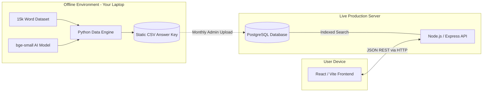
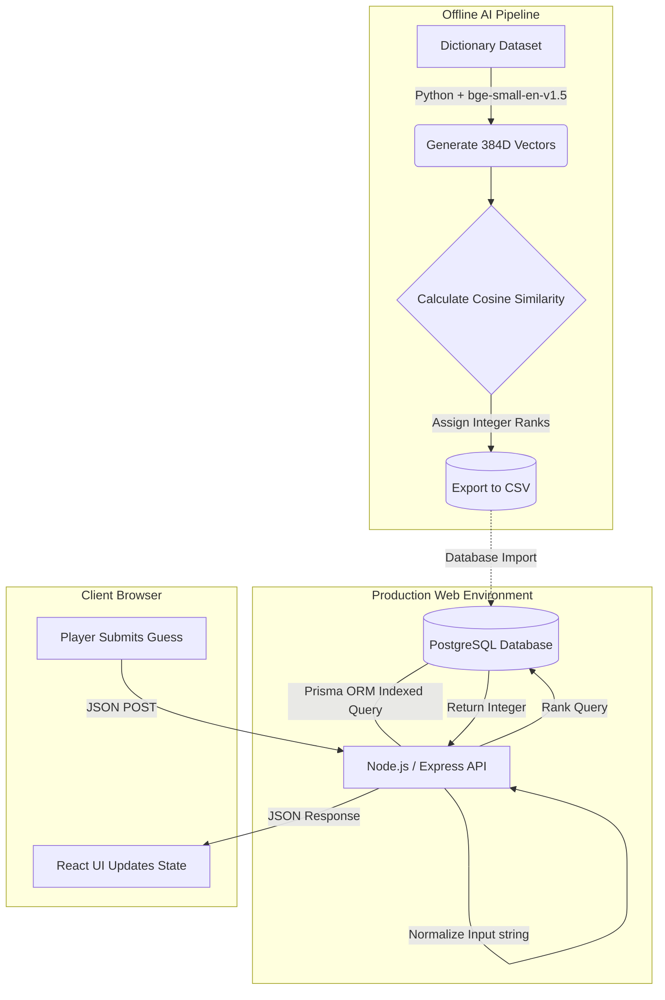
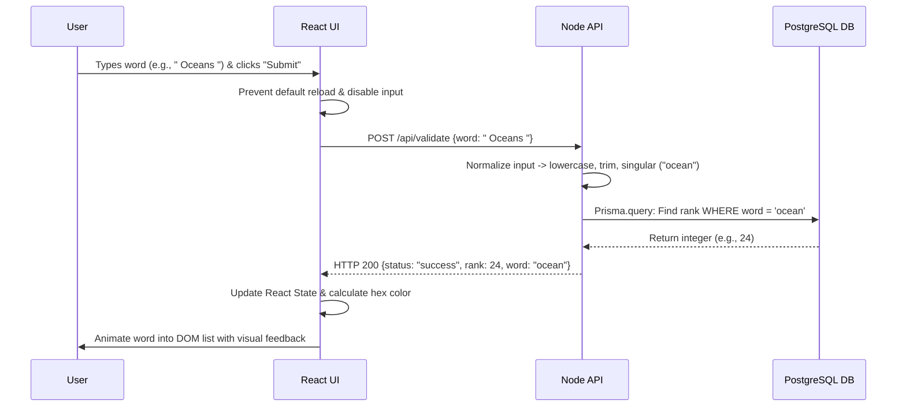

# Engineering Design Document & Technical Report
**Project Title:** Next-Gen Contexto AI: A Scalable Semantic Vector Word Game (v1.5 Hybrid Architecture)

## 1. Overview and Goal
**The Game:** A modern, web-based semantic word puzzle. Players attempt to guess a secret daily word based on contextual meaning rather than spelling. The system ranks every guess based on its spatial linguistic proximity to the target word (e.g., if the target is "Ocean", "Water" ranks highly, while "Bicycle" is mathematically distant).

**The Goal:** To engineer a scalable, highly responsive application that delivers an AI-driven user experience without the computational overhead of live machine learning inference or the DevOps complexity of multi-tiered caching. This "v1.5" architecture balances robust, production-ready logic (security, UX normalization) with a clean, easy-to-maintain database structure.

## 2. Features and Capabilities
*   **High-Speed Indexed Lookups:** Complex vector mathematics are pre-calculated offline. User guesses are validated via lightning-fast indexed integer lookups directly in PostgreSQL, ensuring rapid response times without the overhead of maintaining a separate Redis cache.
*   **Input Normalization (UX Upgrade):** Guesses are cleaned server-side before database lookup. The API automatically handles lowercase conversion, trims whitespace, and performs basic lemmatization (e.g., converting plurals like "Oceans" to "ocean") to prevent frustrating false-negatives for users.
*   **Server-Side Autonomous Solver (Anti-Cheat):** The bot solver logic operates entirely behind a secure, rate-limited Node.js API endpoint. This prevents users from inspecting the frontend bundle via developer tools to extract hints or spoil the daily puzzle.
*   **Pluggable Word Universes:** The data architecture allows for dynamic database table swapping to host themed dictionaries (e.g., Medical Terminology, Tech Jargon) without altering backend logic.
*   **Shareable Trajectory Grids:** Client-side generation of Unicode emoji blocks (🟩 🟨 🟥) representing the player's performance trajectory, optimized for social media sharing.

## 3. System Architecture
The system employs a strictly decoupled, two-tier architecture, optimizing both the AI mathematics and the live web server load.

1.  **Offline AI Pipeline (Data Generation):** A localized Python script utilizes the upgraded, highly accurate `bge-small-en-v1.5` Transformer model. It computes the Cosine Similarity ($\text{similarity} = \cos(\theta) = \frac{\mathbf{A} \cdot \mathbf{B}}{\Vert{}\mathbf{A}\Vert{} \Vert{}\mathbf{B}\Vert{}}$) between target words and all dictionary entries, ranks them, and exports a static flat dataset.
2.  **Live Production Application:** A modern Node.js backend acts as the data-delivery and security layer. It receives the guess, normalizes the text, and interfaces with a PostgreSQL database via Prisma ORM to fetch the pre-computed rank. Postgres serves as both the system of record and the hot-path lookup, minimizing deployment complexity.



## 4. Data Flow Diagram



## 5. Tech Stack Specifications
This stack applies Senior-level engineering concepts to a highly manageable, unified JavaScript/Python ecosystem.

| Domain | Technology | Implementation Justification |
| :--- | :--- | :--- |
| **Offline NLP** | Python, `bge-small-en-v1.5` | Upgraded AI model provides superior semantic mapping on MTEB benchmarks compared to older models. Running it offline completely eliminates live server compute costs. |
| **Backend API** | Node.js (Express), TypeScript | Provides a fast, non-blocking asynchronous environment. Handles input normalization (lemmatization) and secures the solver logic away from the client. |
| **Database & ORM** | PostgreSQL, Prisma ORM | Postgres acts as the sole source of truth and hot-path lookup. With proper indexing on the `word` column, it handles read-heavy validation efficiently without needing Redis. |
| **Frontend** | React (Vite), Tailwind CSS | React handles complex UI state changes (instant list updates and color mapping) seamlessly. Tailwind provides rapid, responsive mobile-first styling. |

## 6. Project Directory Structure
The repository strictly isolates the static AI generation from the web server and securely encapsulates game logic on the backend.

```text
/contexto-nextgen
├── /ai_pipeline                 # Offline AI processing (Never deployed to web server)
│   ├── generate_vectors.py      # Upgraded bge-small-en-v1.5 model script
│   ├── dict_standard.txt        # Raw input vocabulary
│   └── output_ranks.csv         # Final computed ranks for DB insertion
├── /server                      # Node.js Backend
│   ├── prisma/
│   │   └── schema.prisma        # Database schema and index definitions
│   ├── src/
│   │   ├── controllers/
│   │   │   ├── validateGuess.ts # Hot path: normalizes input & queries DB
│   │   │   └── solveDemo.ts     # Secure server-side solver API
│   │   ├── lib/
│   │   │   └── normalize.ts     # Casing, whitespace, and lemmatization rules
│   │   ├── routes/              # API endpoint definitions
│   │   └── server.ts            # Express server initialization
├── /client                      # React Frontend
│   ├── src/
│   │   ├── components/          # GuessList, InputForm, ShareGrid
│   │   ├── App.tsx              # Main application view & state
│   │   └── index.css            # Tailwind directives
└── /docs                        # Project documentation & assets
```

## 7. Sequential Diagram
This sequence maps the exact synchronous lifecycle of a user interaction, highlighting the server-side normalization and direct database lookup.



## 8. Executive Summary
*Next-Gen Contexto v1.5* is a scalable, web-based semantic vocabulary puzzle that perfectly balances high-end software architecture with pragmatic deployment simplicity. It retains the core innovation of resolving expensive NLP mathematics offline—utilizing the superior `bge-small-en-v1.5` transformer model—while serving the resulting integer ranks at runtime.

By avoiding the DevOps overhead of an in-memory caching tier (Redis) and relying on properly indexed PostgreSQL reads, the infrastructure remains clean, highly maintainable, and remarkably fast. Crucially, this version implements professional-grade backend patterns: server-side input normalization guarantees a frictionless user experience, and migrating the bot-solver logic to the API tier entirely eliminates client-side cheating vectors. This hybrid approach demonstrates a strong mastery of modern web development, intelligent trade-off analysis, and robust product design.
